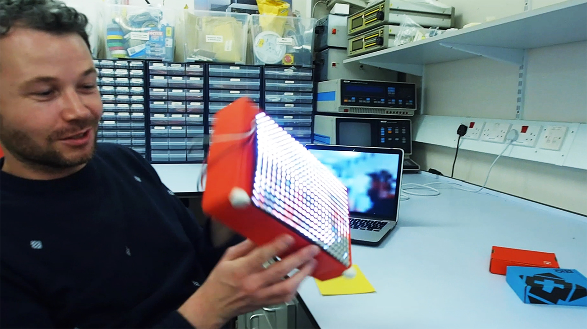

NeoPixel-Screen
===============
This <a href="http://www.x-io.co.uk/products/x-osc/">x-OSC</a> demo is called NeoPixel-Screen and includes a <a href="http://www.openframeworks.cc">openFrameworks</a> C++ application that shows the new <a href="http://www.adafruit.com">Adafruit</a> <a href="http://www.adafruit.com/category/168">NeoPixel</a> support on x-OSC. x-OSC can drive upto 400 neopixels on each output and this demo shows video streaming from a webcam wirelessly to a 24 x 16 NeoPixel screen. 

For more details see <a href="http://www.x-io.co.uk/neopixel-xoscopenframeworks/">this blog post</a>.

 
